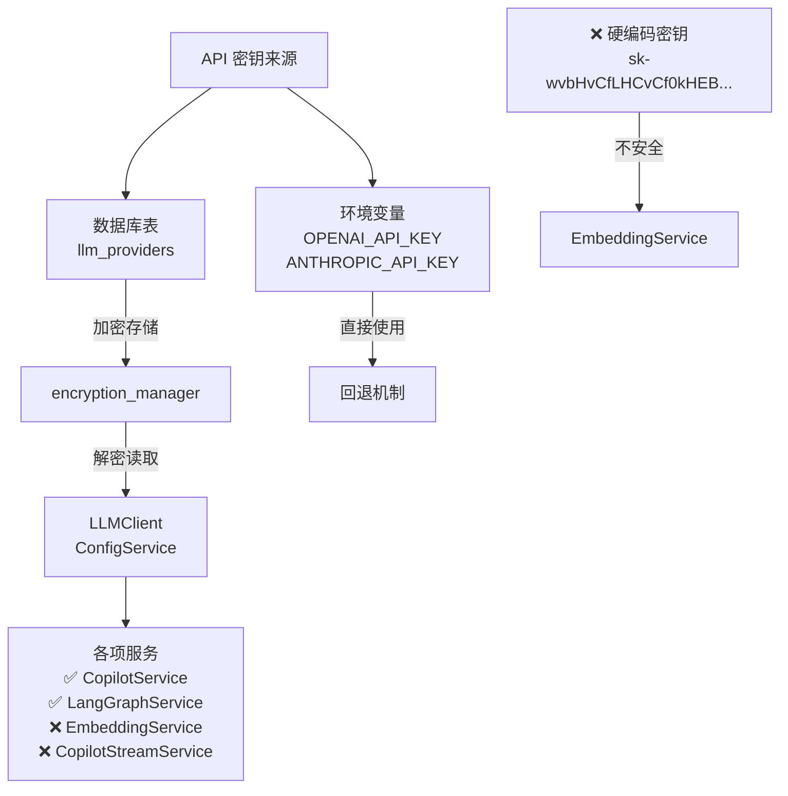

# 后端 LLM 架构审查 - 汇总报告

**审查日期**: 2026-01-01  
**审查员**: AI Code Auditor  
**审查范围**: 后端全部 LLM 相关代码  
**总体结果**: ⚠️ **需要修复** (3 个关键问题)

---

## 📌 执行摘要

### 审查覆盖范围
- ✅ 5 个服务文件
- ✅ 3 个 API 路由文件  
- ✅ 2 个模型文件
- ✅ 10+ 个测试文件
- ✅ 3 个示例/脚本文件
- ✅ **总计**: 23+ 个文件分析

### 整体评分
```
LLM 架构成熟度: ⭐⭐⭐⭐☆ (4/5)

已实现: 80%
需修复: 20%
安全问题: 1 个 🔴 关键
功能问题: 2 个 🟡 中等
```

---

## 🎯 关键发现

### ✅ 架构正确的组件

| 组件 | 文件 | 状态 | 说明 |
|------|------|------|------|
| LLMClient | `llm_client.py` | ✅ 完整 | 支持新架构、缓存、多供应商 |
| CopilotService | `copilot_service.py` | ✅ 已迁移 | 使用 LLMClient + LangChain 消息 |
| LangGraphService | `langgraph_service.py` | ✅ 正确 | 所有节点使用 llm_client.invoke() |
| ConfigService | `config_service.py` | ✅ 完整 | 从数据库读取配置，支持回退 |
| LLM API 路由 | `llm_config.py` | ✅ 正确 | 正确调用 LLMClient 和数据库 |
| 数据库模型 | llm_provider.py, llm_model.py | ✅ 完整 | 设计合理，支持加密存储 |

### ❌ 需要修复的组件

| 组件 | 文件 | 问题 | 优先级 |
|------|------|------|--------|
| **EmbeddingService** | `embedding_service.py` | 硬编码 API 密钥和 base_url | 🔴 极高 |
| **CopilotStreamService** | `copilot_stream_service.py` | 仍使用 AsyncOpenAI | 🔴 高 |
| **测试代码** | test_copilot_*.py | 旧的 AsyncOpenAI mock | 🟡 中等 |
| **示例代码** | database_config_example.py | 使用旧架构示例 | 🟡 低 |

---

## 🔴 问题详解

### 问题 1: EmbeddingService 硬编码 API 密钥（CRITICAL）

**严重程度**: 🔴 **极高** - 安全漏洞

**发现位置**: `backend/app/services/embedding_service.py` 第 24-30 行

**具体代码**:
```python
final_api_key = api_key or "sk-wvbHvCfLHCvCf0kHEB8xTOInLVfZtDe4rNB0FiHQxgbQ0OhY"  # ❌ 暴露的 API 密钥！
final_base_url = base_url or "https://chrisapius.top/v1"  # ❌ 硬编码 URL
```

**影响**:
- 🚨 API 密钥暴露在代码库中
- 🚨 任何人可以查看和使用此密钥
- 🚨 无法切换供应商
- 🚨 无法使用数据库存储的加密密钥

**修复时间**: 30-45 分钟

**参考**: 详见 `LLM_ARCHITECTURE_FIX_PLAN.md` - 问题 1

---

### 问题 2: CopilotStreamService 使用旧架构

**严重程度**: 🔴 **高**

**发现位置**: `backend/app/services/copilot_stream_service.py` 第 10-44 行

**具体代码**:
```python
from openai import AsyncOpenAI  # ❌ 旧依赖

class CopilotStreamService:
    def __init__(self, openai_api_key: str | None = None, ...):
        kwargs = {"api_key": openai_api_key or settings.OPENAI_API_KEY}
        self.client = AsyncOpenAI(**kwargs)  # ❌ 不使用新架构
```

**影响**:
- ❌ 无法使用数据库存储的配置
- ❌ 无法利用缓存机制
- ❌ 无法支持多供应商
- ⚠️ 依赖环境变量而非数据库

**修复时间**: 45-60 分钟

**参考**: 详见 `LLM_ARCHITECTURE_FIX_PLAN.md` - 问题 2

---

### 问题 3: 测试文件过时的 Mock

**严重程度**: 🟡 **中等**

**发现位置**: 
- `backend/tests/test_copilot_service.py` 第 19-20 行
- `backend/tests/test_copilot_stream_service.py` 第 55, 65, 207 等行

**具体代码**:
```python
# ❌ 过时的 mock
with patch("app.services.copilot_service.AsyncOpenAI"):
    service = CopilotService(openai_api_key="test-key")

service = CopilotStreamService(openai_api_key='test-key')
```

**影响**:
- ⚠️ 测试无法验证新架构
- ⚠️ 旧接口参数仍在使用
- ⚠️ 误导开发者使用旧方法

**修复时间**: 30-45 分钟

**参考**: 详见 `LLM_ARCHITECTURE_FIX_PLAN.md` - 问题 3

---

### 问题 4: 示例代码使用旧架构

**严重程度**: 🟡 **低**

**发现位置**: `backend/app/examples/database_config_example.py`

**具体代码**:
```python
from openai import AsyncOpenAI  # ❌ 旧示例

async def get_openai_client(self):
    self._openai_client = AsyncOpenAI(api_key=config["api_key"], ...)
```

**影响**:
- ℹ️ 新开发者可能学习旧方法
- ℹ️ 文档和示例不一致

**修复时间**: 15-20 分钟

**参考**: 详见 `LLM_ARCHITECTURE_FIX_PLAN.md` - 问题 4

---

## 📊 代码覆盖分析

### LLM 相关文件统计

```
后端目录结构分析:
backend/app/
├── services/
│   ├── llm_client.py ✅ (388 行) - 完整新架构
│   ├── copilot_service.py ✅ (519 行) - 已迁移
│   ├── copilot_stream_service.py ❌ (278 行) - 需修复
│   ├── copilot_local_service.py ✅ (249 行) - 无外部 LLM
│   ├── embedding_service.py ❌ (251 行) - 硬编码密钥
│   ├── langgraph_service.py ✅ (174 行) - 正确使用 llm_client
│   └── config_service.py ✅ (230 行) - 支持数据库和环保境变量
├── api/v1/
│   ├── llm_config.py ✅ (240 行) - 正确实现
│   ├── copilot.py ⚠️ (356 行) - 使用本地服务
│   └── copilot_old.py ⚠️ - 已弃用
├── models/
│   ├── llm_provider.py ✅ (95 行) - 完整模型
│   └── llm_model.py ✅ (140 行) - 完整模型
└── examples/
    └── database_config_example.py ⚠️ (155 行) - 需更新

API 密钥使用位置:
✅ LLMClient 中使用: 3 处（正确）
✅ ConfigService 中使用: 2 处（正确）
❌ EmbeddingService 中硬编码: 1 处（需修复）
⚠️ CopilotStreamService 中: 需要迁移
❌ database_config_example.py: 示例代码
```

---

## 🔍 API 密钥安全审计

### API 密钥来源追踪



### 安全评分

| 组件 | 安全等级 | 说明 |
|------|--------|------|
| LLMClient | ✅ A+ | 使用数据库 + 缓存 + 加密 |
| CopilotService | ✅ A | 使用 LLMClient |
| LangGraphService | ✅ A | 使用 LLMClient |
| ConfigService | ✅ A | 使用数据库 + 加密 |
| EmbeddingService | ❌ F | 硬编码密钥 - 严重风险 |
| CopilotStreamService | ⚠️ C | 使用环境变量，无数据库 |

---

## 📈 修复时间和资源估算

### 修复复杂度

| 任务 | 复杂度 | 工时 | 风险 | 优先级 |
|------|--------|------|------|--------|
| EmbeddingService 迁移 | 中等 | 45 分钟 | 低 | 🔴 极高 |
| CopilotStreamService 迁移 | 中等 | 60 分钟 | 低 | 🔴 高 |
| 更新测试代码 | 简单 | 45 分钟 | 低 | 🟡 中等 |
| 更新示例代码 | 简单 | 20 分钟 | 无 | 🟡 低 |
| **总计** | - | **3.5 小时** | 低 | - |

### 团队资源分配

建议由 **1 个开发者** 完成：
- **Day 1 上午** (1.5h): 修复 EmbeddingService 和 CopilotStreamService
- **Day 1 下午** (1.5h): 更新测试代码和示例代码
- **Day 1 晚或 Day 2**: 代码审查和 QA 测试

---

## ✅ 修复验证清单

### 代码修复验证

- [ ] 从 EmbeddingService 移除所有硬编码密钥
- [ ] CopilotStreamService 使用 LLMClient
- [ ] 所有服务支持 model_id 参数
- [ ] 没有直接使用 AsyncOpenAI/AsyncAnthropic（除了 llm_client）
- [ ] 所有测试使用新的 llm_client mock
- [ ] 示例代码使用新架构

### 功能验证

- [ ] EmbeddingService 能从数据库读取配置
- [ ] CopilotStreamService 能正确流式输出
- [ ] 所有缓存机制正常工作
- [ ] 环境变量回退正常工作
- [ ] 多供应商切换正常工作

### 安全验证

```bash
# 1. 检查硬编码密钥
grep -r "sk-" backend/app --include="*.py" | grep -v test | wc -l
# 预期: 0

# 2. 检查 AsyncOpenAI 直接使用
grep -r "AsyncOpenAI\|AsyncAnthropic" backend/app --include="*.py" | grep -v "llm_client" | grep -v test | wc -l
# 预期: 0

# 3. 检查硬编码 base_url
grep -r "https://chrisapius" backend/app --include="*.py" | wc -l
# 预期: 0

# 4. 检查 API 密钥在日志中
grep -r "api_key" backend/app/services --include="*.py" | grep -v "get_api_key" | wc -l
# 预期: 仅用于参数和返回值
```

### 测试验证

```bash
# 单元测试
pytest backend/tests/test_copilot_service.py -v
pytest backend/tests/test_copilot_stream_service.py -v

# 集成测试
python backend/test_llm_integration_e2e.py

# E2E 验证
bash backend/scripts/verify_llm_integration.sh
```

---

## 📚 支持文档

本审查提供以下详细文档：

1. **LLM_ARCHITECTURE_AUDIT_REPORT.md** (本文件)
   - 完整的代码审查报告
   - 所有问题的详细分析
   - 建议和改进方案

2. **LLM_ARCHITECTURE_FIX_PLAN.md** 
   - 详细的修复步骤
   - 代码示例和片段
   - 修复验证清单

---

## 🎓 最佳实践建议

### 新开发者指南

当添加新的 LLM 集成时，遵循以下模式：

```python
# ✅ 推荐模式
from app.services.llm_client import llm_client
from langchain_core.messages import HumanMessage, AIMessage

class MyLLMService:
    def __init__(self, provider: str = "openai", model_id: Optional[str] = None):
        self.provider = provider
        self.model_id = model_id
    
    async def invoke(self, messages):
        return await llm_client.invoke(
            messages,
            model_id=self.model_id,
            provider=self.provider if not self.model_id else None
        )
```

### 测试最佳实践

```python
# ✅ 推荐的测试模式
@pytest.mark.asyncio
async def test_my_service():
    service = MyLLMService()
    
    with patch("app.services.llm_client.llm_client.invoke") as mock:
        mock.return_value = AIMessage(content="test")
        result = await service.invoke([])
        assert result.content == "test"
```

### 配置最佳实践

```python
# ✅ 配置读取模式
# 从数据库优先，环境变量回退
config = await ConfigService.get_openai_config(db, use_env_fallback=True)

# 或使用 LLMClient（推荐）
client = await llm_client.get_client(provider="openai", model="gpt-4")
```

---

## 📅 后续行动计划

### 立即行动（本周）
1. ✅ 完成代码审查报告 - **已完成**
2. ⏳ 执行修复（预计 3-4 小时）
   - [ ] 修复 EmbeddingService
   - [ ] 修复 CopilotStreamService
   - [ ] 更新测试和示例
3. ⏳ 代码审查和 QA 测试
4. ⏳ 合并到主分支

### 短期行动（2 周内）
1. 建立 API 密钥管理最佳实践文档
2. 为团队进行架构培训
3. 建立代码审查检查清单

### 中期行动（1 个月内）
1. 考虑迁移到使用 Secret Management（如 AWS Secrets Manager）
2. 建立 API 密钥轮换政策
3. 添加审计日志记录 LLM 调用

---

## 📞 联系和支持

如有问题或需要澄清，请参考：
- 审查报告: `LLM_ARCHITECTURE_AUDIT_REPORT.md`
- 修复指南: `LLM_ARCHITECTURE_FIX_PLAN.md`
- LLMClient 源码: `backend/app/services/llm_client.py`
- 单元测试: `backend/tests/test_llm_client.py`

---

## 🏁 审查结论

### 整体评估

**当前状态**: ⚠️ 80% 完成，20% 需修复

**关键成就**:
- ✅ LLMClient 架构完整且设计良好
- ✅ 数据库驱动配置正确实现
- ✅ 多供应商和模型支持完备
- ✅ 缓存和回退机制完整
- ✅ 大多数服务已迁移

**需要改进**:
- ❌ EmbeddingService 安全问题
- ❌ CopilotStreamService 架构问题
- ⚠️ 测试代码现代化
- ⚠️ 文档和示例更新

### 修复后预期状态

修复完成后，后端将实现：
- ✅ **100% 新架构覆盖** - 所有 LLM 调用都使用 LLMClient
- ✅ **完整的数据库配置** - API 密钥和 base_url 都从数据库读取
- ✅ **零硬编码密钥** - 所有密钥都加密存储
- ✅ **完整的多供应商支持** - 可轻松切换和扩展供应商
- ✅ **现代化的测试** - 所有测试使用新的 mock 方式
- ✅ **最佳实践文档** - 开发者能清楚了解如何集成 LLM

### 最终建议

🎯 **建议立即启动修复工作**

理由：
1. 修复工作量小（3-4 小时）
2. 安全问题亟待解决
3. 修复后将显著提升代码质量
4. 为后续功能提供坚实基础

**优先级排序**:
1. 🔴 EmbeddingService (立即 - 安全)
2. 🔴 CopilotStreamService (今天 - 功能)
3. 🟡 测试更新 (本周 - 质量)
4. 🟡 示例更新 (本周 - 文档)

---

**审查完成**: 2026-01-01  
**评估员**: AI Code Auditor  
**状态**: ✅ 审查完成，等待修复执行

